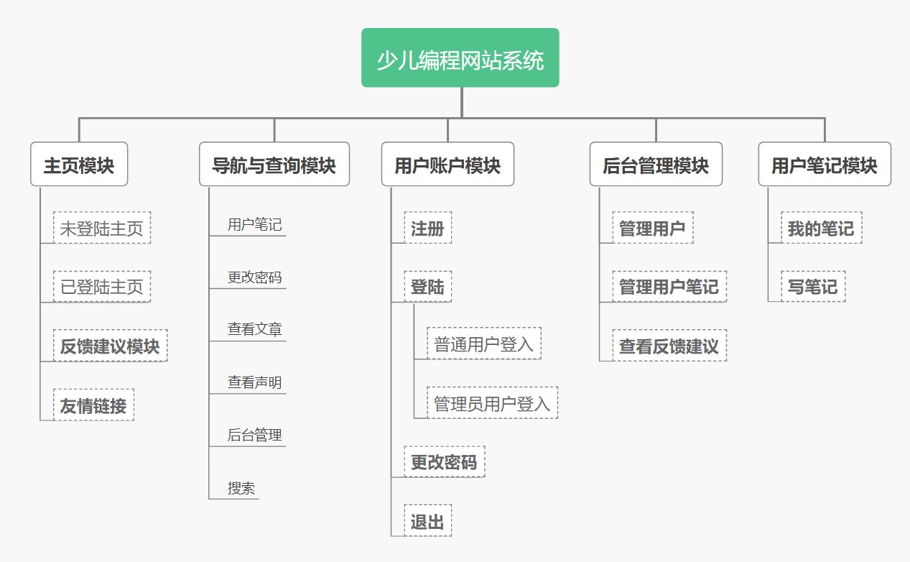
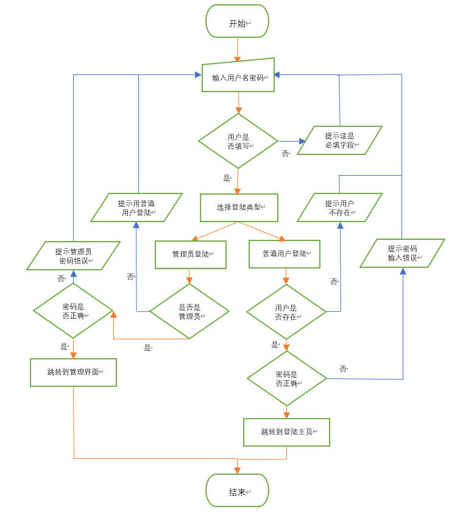
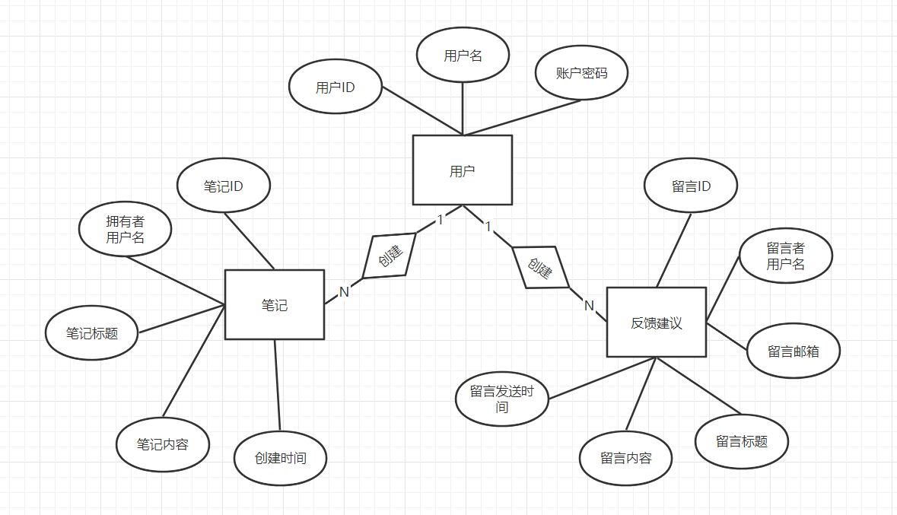
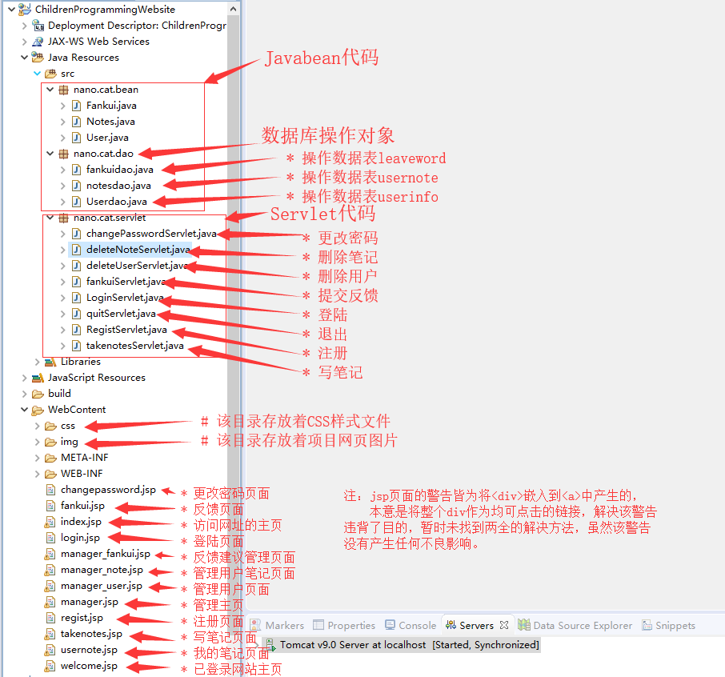

# 基于Java web的少儿编程网站

## 介绍

* 系统使用了MVC开发模式，未使用框架，东西做的很简单。
* 为毕设写的，看到别人用各种框架做的精美页面我留下了泪水，技术都是基础且过时的技术，可能现在没人用了吧┑(￣Д ￣)┍，不过用来学习基础的java web还是可以的。
* 使用了的语言：java - servlet；jsp；SQL以及前端三件套

## 系统功能结构

* 论文里画的图，看起来似乎功能挺多的，实际上就是几个小功能╮(╯▽╰)╭

## 部分流程图示例

* 登陆的流程图，用word画的图【用word画图还能凑字数哦(/▽＼)，查重会将这些字拼接起来变成一串长字符串】

## E-R图

* 由于系统实在是很简单，所以数据库只弄了3个表＞︿＜

## 代码目录结构

## PS

* 导师说我做的东西很简单，但论文陈述得很清楚图画的很好，答辩也顺利过了。不过简单的代码我编了17k字的论文，简直比我高中作文还能编orz